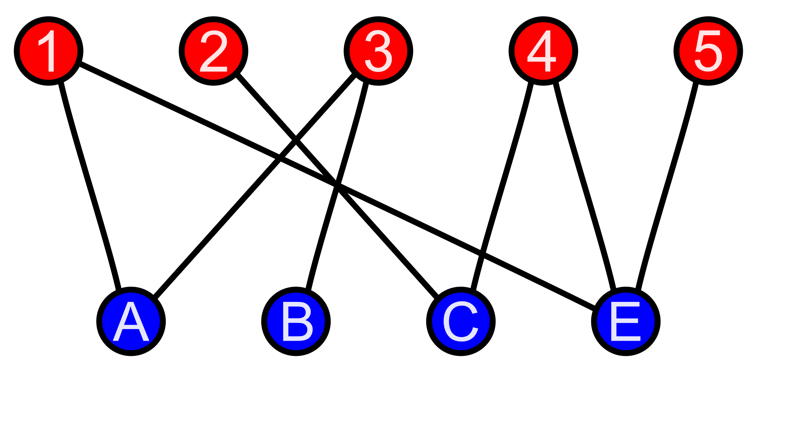

# Bipartite

Bipartite graph is a graph that we can divide edges into 2 separate groups. Group1(1,2,3,4,5), Group2(A,B,C,E)  
Each group there is no connection between them.  
To resolve this problem using coloring  algorithm  
1. Assign 1 color to current vertex
2. Assign opposite color to all its neighbors  
3. Check if any conflict(any neighbor have same color as current vertex) --> return false

```plaintext
    WHITE, RED, BLUE = -1, 0, 1
    color = [WHILE] * n
    dfs(u, next_color):
        color[u] = next_color #color for current vertex
        for neighbor in neighbor of u:
            if u and neighbor same color --> return false
            elif neightbor yet to colorr:
                dfs(neighbor, 1 - next_color) --> color opposite color
            else: u and neighbor different color --> pass
    for u in range n:
        if u yet to color:
            dfs(u, BLUE)
```
