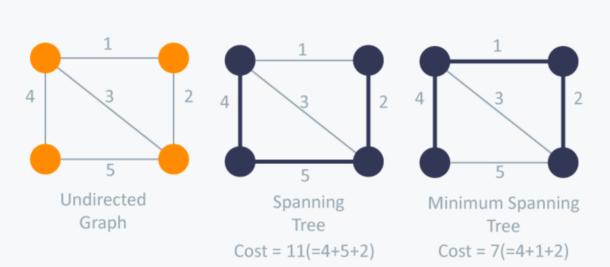

# Minimum Spanning tree
G = (V, E)  
T = (V, F)  

Can imagine, a spanning tree is a path can connect all vertices in a connected graph     
T is a spanning tree of G if: F is children of E  
Condition for a graph to be having a spanning tree is connected graph  
To check connect graph --> [Union Find](../union-find/union-find.md)  
Real use case: build a road to connect N city with minimum cost  
Algorithm: Kruskal
### Pseudo code
