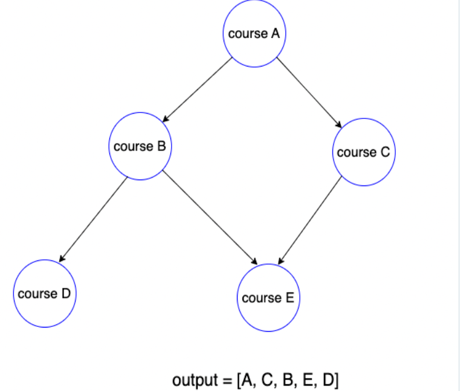

# Topological sort
Mainly to solve prerequisites problem.  
In a DAG(Directed Acyclic graph)  
To study course D: A -> B -> D



### Pseudo code  
```plaintext
    #Change edge to adjancent list and build degree array
    for u,v in edgeList:
        adjList[u].append(v)
        degree[v] += 1
    #Add add vertices has degree = 0 to queue
    for i in range(n):
        if degree[i] == 0: q.append(i)
    while q:
        current = q.popLeft()
        for neighbor in adjList[current]:  #Decrease 1 degree of each neighbor, if == 0 --> add to queue
            degree[neighbor] -=1
            if degree[neighbor] == 0:
                q.append(neighbor)
```