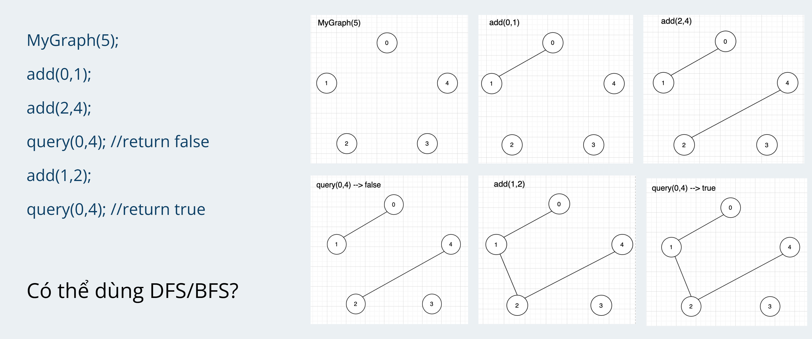

# Union Find
Signal for a union find problem:  
Group,set , connectivity graph, dynamic add an edge to graph,...  
Implement a class to represent and undirected graph:  
* MyGraph(int n): initiate a graph, n vertex and no edges
* add(u, v) --> add an edge u, v
* boolean query(u, v) --> check if u and v are connected?
* int count(): number of connected components?


### Union Find algorithm  

Statement 1: 2 vertex are connected --> has same root  
Statement 2: if we add an edge(u, v) --> we can say edge(root of u, root of v)  
There are 2 function
union(u, v) --> union component of u and v
find(u) --> root of u  

### Pseudo code  

```plaintext
    parent = [-1] * n
    def find(u: int) ->int: #find root of u
        while parent[u] != -1:
            u = parent[u]
        return u
    
    def union(int u, int v):    #union 2 connected component
        parent[v] = u
    
    def add(int i, int j):
        #find root i and j
        u = find(i)
        v = find(j)
        if u != v:  #if root of u and root of v are different --> union
            union(u,v)
            
    def query(int i, int j):
        return find(i) == find(j) --> root of i == root of j --> connected component
```

### Union Find patten:  

#### Cycle detection  
During an edge addition, both vertices belong to same set(Same root) --> cycle detected
```plaintext
    def hasCycle(edges):
        for (u, v) in edges:
            ru = find(u), rv = find(v)
            if ru != rv:
                union(ru, rv)
            else:
                --> cycle detected
```
684 - [Redundant connection](cycle-detection/684-redundant-connection.py)
#### Connected component  
1. Union all edges  
2. Count number of connected component  
```plaintext
    def find-connected-component(edges)
        for (u, v) in edges:
            union(u, v)
        #count number of component
        for i in range(n):
            if parent[i] == -1:
                count++
```
839 - [Similar string groups](connected-component/839-similar-string-groups.py)
721 - [Accounts merge](connected-component/721-accounts-merge.py)
#### Dynamic connectivity  
305 - [Number of islands 2](dynamic-connectivity/305-number-of-islands.py)