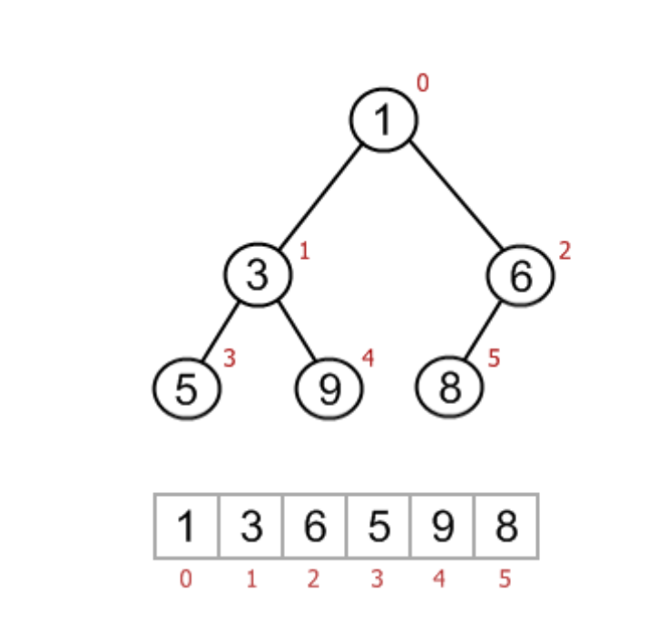

# Heap
Full binary tree: at each node has either 0 or 2 children  
Complete binary tree: left filled from left to right   
Perfect binary tree: every node has 2 children and all leave at same level

# Heap property
Index from N/2 -> N - 1 are leaf  
Index from 0 -> N / 2 - 1 are inter node

If 1 node index i:  
    - Left child:  2 * i + 1  
    - Right child: 2 * i + 2
    - Paren:       (i - 1) / 2  
Sample heap:

# Heap operation

### heapify: O(n)
**Heap up**(Build from right most leaf: n - 1 to n // 2)
From the child: check current parent if greater than child, swap(parent should be smaller than children) 
```plaintext
    def heapifyUp(arr, i):
        while i > 0:
            parent = (i - 2) // 2
            if arr[parent] > arr[i]:    #if parent greater than child, promote child to parent
                arr[parent], arr[i] = arr[i], arr[parent]
                index = paren
            else:   #otherwise, sastify heap property(parent <= child)
                break 
```
**Heap down**(build from last non-leaf back to root, n // 2 - 1 --> 0)  
```plaintext
    def heapifyDown(arr, i):
        while true:
            smallest = i
            leflChild = 2 * i + 1
            rightChild = 2 * i + 1
            if leftChild < n and arr[leftChild] < arr[smallest]
                smallest = leftChild
            if rightChild < n and arr[rightChild] < arr[smallest]
                smallest = rightChild
            if smallest != i:   #found smallest value is not parent, 
                arr[smallest], arr[i] = a[i], arr[smallest]
                i = smallest    #deep down
            else:   #parent is smallest, sastify heap property
                break
```
            
At the parent, find left and right child
Among 3 values, find smallest and swap to parent
### heappush: O(logn)
Add element to last then heap_up
```plaintext
    def heap_push(arr, val:int)
        arr.append(val)
        heap_up(arr, len(arr) - 1)
```
### heappop: O(logn)
Swap root and last element.  
Pop last element
heap_down
```plaintext
    def heap_pop(arr):
        arr[0], arr[-1] = arr[-1], a[0]
        arr.pop()
        heap_down(arr, 0)

```

### Heap sort
```plaintext
    def heap_sort(arr):
        #build a max heap, first element is max now
        for i in range(n // 2 - 1, -1, -1)
            heap_down(arr,n, i) 
        for i in range(n - 1, 0, -1):
            arr[i], arr[0] = arr[0], arr[i] #i is max now, lets heapify from 0 to i - 1
            heap_down(arr, i, 0)
```