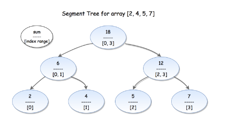

# Segment tree

If a tree balanced --> height = Log(n)

### Segment tree property


If 1 node index i:  
    - Left child:  2 * i  
    - Right child: 2 * i + 1  
    - Parent = i / 2  
--> If node % 2 == 1 --> Right child  
--> If node % 2 == 0 --> Left child  
### Build segment tree
Step 1: Build the leaf: from n --> 2*n - 1 is original array  
Step 2: Build intermediate node. Node i = left + right = 2 * i + 2 * i + 1  
**Pseudo code**
```plaintext
    tree = [0] * (2 * n)
    #Build the leaf
    for i range(n):
        tree[n + i] = nums[i]
    #Build intermediate node:
    for i in range(n - 1, 0, -1)
        tree[i] = tree[2 * i] + tree[2 * i + 1]
```
TC: O(n)  
SC: O(n)  

### Update segment tree
Update element at i index, need to re-update the parent
TC: O(log(n))
SC: O(1)
**Pseudo code**
```plaintext
    def update(pos, val)
        pos += n
        tree[pos] = val
        while pos > 0
            left = pos
            right = pos
            if pos % 2 == 0:
                right = pos + 1
            else:
                left = pos - 1
            tree[pos / 2] = tree[left] + tree[right]
            pos /= 2

```

### Query segment tree
If left is right child(odd index) --> sum += nums[left] --> move to right of parent((l + 1) / 2)  
Else sum += nums[Parent](l / 2)   
If right is left child(even index) --> sum += nums[right] --> move to left of parent(r - 1) / 2  
Else sum += nums[Paren](r / 2)  

**Pseudo code**
```plaintext
    def query(l,r):
        while l < r:
            if l % 2 == 1:  #left is right child
                sum += tree[l]
                l++         #Move to right of parent
            if r % 2 == 0   #right is left child
                sum += tree[r]
                r--         #Move to left of parent
            l = l / 2
            r = r / 2       #Move to parent level
                
```
